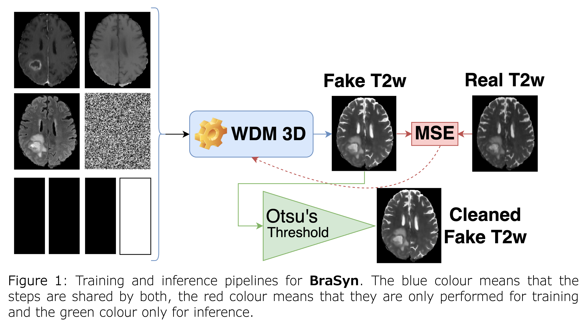

# Faking_it team! BraTS submissions.

## [BraTS 2024 - Task 7 - Synthesis (Global) - Missing MRI ](https://www.synapse.org/Synapse:syn53708249/wiki/627507)

### Introduction to the challenge:

Automated brain tumor segmentation methods have seen great success recently, reaching performance levels with clear clinical utility. Most algorithms require four complete input magnetic resonance imaging (MRI) modalities, typically T1-weighted images with and without contrast enhancement, T2-weighted images, and FLAIR images. However, a common challenge in clinical routine is missing MR sequences, e.g., because of time constraints and/or image artifacts (such as patient motion). Therefore, substituting missing modalities to recover segmentation performance in these scenarios is highly desirable and necessary for the more widespread adoption of such algorithms in clinical routine.

The **BraSyn-2024** dataset is based on the **RSNA-ASNR-MICCAI BraTS 2021** dataset [1]. It describes a retrospective collection of brain tumor mpMRI scans acquired from multiple institutions under standard clinical conditions but with different equipment and imaging protocols, resulting in a vastly heterogeneous image quality reflecting diverse clinical practice across different institutions. Expert neuroradiologists approved ground truth annotations of every tumor sub-region.
During the validation and test stages, the segmentation mask corresponding to images is unavailable for each subject, and one of the four modalities will be **randomly** excluded (`dropout').
The participants are required to synthesize missing modalities

### Solution - Brain Tumour Removing and Missing Modality Generation using 3D Wavelet Diffusion Model (To be published)

Our solution explores the 3D Wavelet Diffusion Models (3D WDM) for conditional Medical Image Synthetis.

**[Pipeline overview of the vanilla 3D WDM:](https://github.com/pfriedri/wdm-3d)**

Two main solutions were created:

* Default (Dg): No changes are made to the vanilla 3D WDM excpet that: 32 channels of input and output channels (4 modalities*8).;
* Known 3 to 1 (K3T1g): Only the missing modality is generated. The 3 known modalities have no noise in all steps of WDM training and inference, only the modality of interest (MOI). The input shape has 4 more channels to inform the network which modality to generate, as shown in the next figure. 36 channels of input and 8 channels of output.

#### Run conditional 3D WDM training (We shared the weights of `known_3_to_gen_1`)

**To run the training:**

1. `cd json_creator.ipynb`
   1. change the `root_data_dir` and run the cell to create the json file.
2. `cd .Synthesis/Task7/wdm-3d`
3. Make the necessary changes in `run.sh`. You can easily control the:
   1. `MODE='train'` (set 'train' for training)
   2. `TRAIN_MODE='known_3_to_gen_1'` (Training modes available: default or known_all_time or known_3_to_gen_1(recommended))
   3. `DATA_DIR=../../DataSet/ASNR-MICCAI-BraTS2023-GLI-Challenge-TrainingData` (Directory containing all samples)
   4. `DATA_SPLIT_JSON=../utils/BraTS2023-Missing_modal_training_data_split.json` (Json file)
   5. `resume_checkpoint=./runs/known_3_to_gen_1_27_7_2024_16:16:14/checkpoints/brats_2000000.pt` (Checkpoint to resume training)
   6. `resume_step=2000000` (Step to resume training)
4. run `bash run.sh`

A folder `runs` will be created with the checkpoints and the Tensorboard file. Scans checkpoints are saved, as well as the training losses. In case lack of RAM, go to `wdm-3d/c_brats_loader.py` -> `CacheDataset` and reduce `cache_rate`.

#### Run inference (experiments)

To run some experiments, you can use the same command `bash run.sh`, but first you need to change some arguments inside of this file:

1. `MODE='sample'` (set to 'sample')
2. `ITERATIONS=2000;` (training iteration (as a multiple of 1k) checkpoint to use for sampling)
3. `SAMPLING_STEPS=3000; ` (number of steps for accelerated sampling, 0 for the default 1000. We used 3000 (very slow).)
4. `RUN_DIR="runs/known_3_to_gen_1_27_7_2024_16:16:14/"; `(tensorboard dir to be set for the evaluation -> runs/.../)

It will randomly choose a modality to drop and generate. The results will be saved in `./results/{TRAIN_MODE}`.

#### Run inference (validation and testing sets)

**To run the inference in a test set:**

1. `cd testing/`
2. `python inference.py --data_path ./DataSet/ASNR-MICCAI-BraTS2023-GLI-Challenge-TestData --output_path ./predictions --model_path ../wdm-3d/runs/known_3_to_gen_1/brats_2000000.pt`
   1. Place the dataset in the DataSet folder (or somewhere else).
   2. Make sure the model path is correct.

**By default:**

* `noise_schedule="linear"`
* `train_mode="known_3_to_gen_1"`
* `sampling_steps=3000` (Very slow! Reduce for faster (but a bit worse) inference.)

To change these, dig into the `inference.py` file.

It will be created a folder with the same name as the dataset in the `predictions` folder.

---

# END
