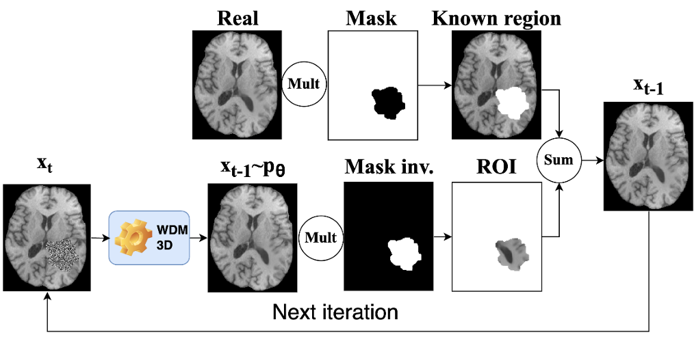

# Faking_it team! BraTS submissions.

## [BraTS 2024 - Task 8 - Synthesis (Local) - Inpainting](https://www.synapse.org/Synapse:syn53708249/wiki/627498)

### Introduction to the challenge:

**Inpainting for Medical Imaging** : Inpainting is a well-established technique in computer vision, with successful algorithms designed to fill missing regions in 2D images. However, applying these methods to 3D medical images like MRI scans remains an open question. This challenge provides a platform to explore this potential and benchmark new inpainting techniques for brain tumor analysis.

 **Clinical Significance** : Many algorithms for automatic brain MRI analysis support clinical decision-making. However, these algorithms often struggle with images containing tumors, as they are typically trained on healthy brains. This challenge addresses this limitation by focusing on synthesizing healthy tissue representations in tumor-affected regions. This could significantly improve the performance of existing algorithms for tasks like, but not limited to:

* Brain anatomy parcellation
* Tissue segmentation
* Brain extraction
* Brain tumor growth modeling

By overcoming the challenges of tumor-affected scans, we aim to improve the accuracy and reliability of automated brain image analysis in clinical settings.

### Solution - Brain Tumour Removing and Missing Modality Generation using 3D Wavelet Diffusion Model (To be published)

Our solution explores the 3D Wavelet Diffusion Models (3D WDM) for conditional Medical Image Synthetis.

**[Pipeline overview of the vanilla 3D WDM:](https://github.com/pfriedri/wdm-3d)**

Two main solutions were created:

* Default (Dl): 3D WDM without any changes. For sampling (Figure below), the known region is replaced by the original scan (at each step t), keeping only the generated region to interest (ROI), i.e., to inpaint;

* Always known healthy (AKHl): Unhealthy tissue is removed, even from the ground-truth. The healthy mask is concatenated in the input (also in the inference the mask is concatenated with  `Xt`, see figure bellow). Noise is only added to the ROI, the known tissue never has noise, neither during training nor during inference.

#### Data augmentation strategy

We start by creating more random healthy masks. We trained a GAN from scratch, to meet the challenge requirements, but to avoid training more GANs (very time consuming), you can use the same label generator model trained to generate synthetic labels, as explained in [How we won BraTS 2023 Adult Glioma challenge? Just faking it! Enhanced Synthetic Data Augmentation and Model Ensemble for brain tumour segmentation](https://arxiv.org/abs/2402.17317). To train the generator, take a look at [BraTS2023_Task1.md](./BraTS2023_Task1.md), `Label generator `more concretly.

**Not recommended:** If you want to train a GAN using the labels provided in this dataset, you can use the same approach that was used for the [BraTS2024 meningioma dataset](./BraTS2024_Task3.md), but remember to create the correct csv file (you will need to play around with the `csv_creator.py`).

**After training the generator (the recommended one!):**

1. `cd data_creator`
2. Copy the generator to the folder .`/weights`, just for convinience.
3. `python run_data_creator.py --data_dir ../../DataSet/ASNR-MICCAI-BraTS2023-Local-Synthesis-Challenge-Training --json_file ./ASNR-MICCAI-BraTS2023-Local-Synthesis-Challenge-Training.json --save_folder ./New_DataSet --model_path ./weights/LabelGenerator.pth --only_real_seg False --only_fake_seg False --begin 0 --end end --new_cases_per_case 5`
   1. A folder `metadata` is created with information of each new healthy mask -> n_tumours, if each tumour is fake or not, and if gave up (didn't find a place to fit the new mask) after some time.
   2. The data will be created in the `--save_folder`. Recommended letting `./New_DataSet`.

At this stage several synthetic healthy masks and respective voided T1c scans will be created.

#### Conditional 3D WDM training

1. Create the json file by running the cells of `json_file_creator.ipynb`.

   1. Make sure the paths are corrected.
   2. If syntehtic masks were created, the json file will have "augmented_" in the name.
2. `cd wdm-3d`
3. run `bash run.sh`. Inside the file you can change several variables:

   1. `MODE='c_train';` (set 'train' for training)
   2. `TRAIN_MODE=Conditional_always_known_only_healthy;` (other modes can be find in the run.sh file)
   3. `DATA_DIR=../../DataSet/ASNR-MICCAI-BraTS2023-Local-Synthesis-Challenge-Training;` (Directory containing all samples)
   4. `DATA_SPLIT_JSON=./augmented_ASNR-MICCAI-BraTS2023-Local-Synthesis-Challenge-Training.json;` (Json file)
   5. `--resume_checkpoint=./runs/Conditional_always_known_only_healthy_31_7_2024_12:35:11/checkpoints/c_brats_3000000.pt` (Checkpoint to resume training)
   6. `--resume_step=3000000` (Step to resume training)

A folder `runs` will be created with the checkpoints and the Tensorboard file. Scans checkpoints are saved, as well as the training losses. In case lack of RAM, go to `wdm-3d/c_brats_loader.py` -> `CacheDataset` and reduce `cache_rate`.

#### Run inference (experiments)

**Change the variables:**

1. `MODE='c_sample';`
2. `ITERATIONS=3000;` (training iteration (as a multiple of 1k) checkpoint to use for sampling)
3. `SAMPLING_STEPS=5000; `(number of steps for accelerated sampling, 0 for the default 1000)
4. `NOISE_SCHEDULE=linear;` (linear(original) or cosine)
5. `STEPS_SCHEDULER=None;`  (None for default linear without changes, DPM_plus_plus_2M_Karras or cosine)
6. `RUN_DIR="runs/Conditional_always_known_only_healthy_31_7_2024_12:35:11";` (tensorboard dir to be set for the evaluation -> runs/.../)
7. `OUTPUT_DIR="results/Conditional_always_known_only_healthy_5000steps_linear_3000iter";`
8. `BEG=0;` (case to start)
9. `END=end;` (case to finish)

#### Run inference (validation and testing sets)

**To run the inference in a test set:**

1. `cd testing/`
2. Check all "Defining IMPORTANT args" inside the `inference.py` file, specially:
   1. `sampling_steps=5000`
   2. `train_mode="Conditional_always_known_only_healthy"`
3. `python inference.py --data_path DataSet/ASNR-MICCAI-BraTS2023-Local-Synthesis-Challenge-Validation --output_path ./predictions --model_path ../wdm-3d/runs/Conditional_always_known_only_healthy_31_7_2024_12:35:11/checkpoints/c_brats_3000000.pt --beg_case 0 --end_case end`
   1. Place the dataset in the DataSet folder (or somewhere else).
   2. Make sure the model path is correct.
   3. You can control what files are selected for inference with `--beg_case` and `--end_case`.
   4. `iter_output` folder will be created

---

# END
